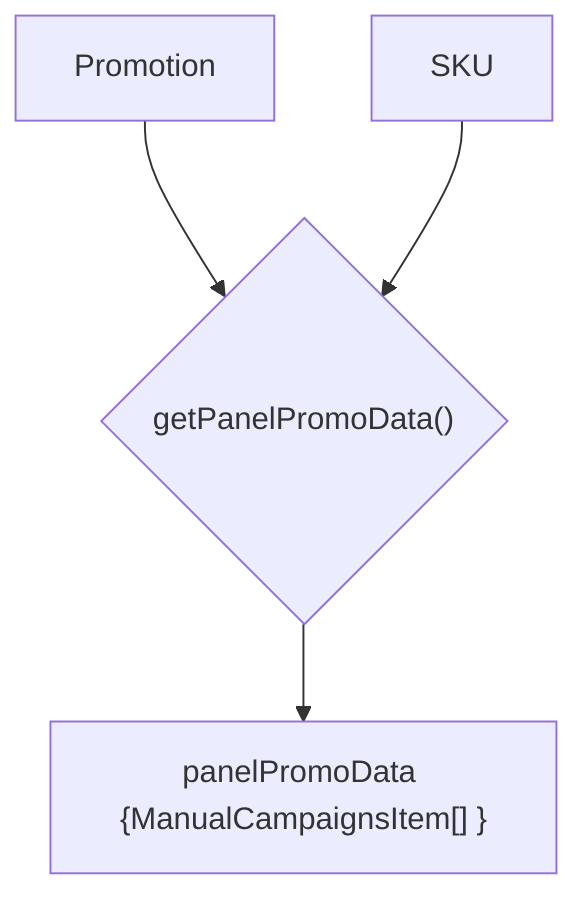
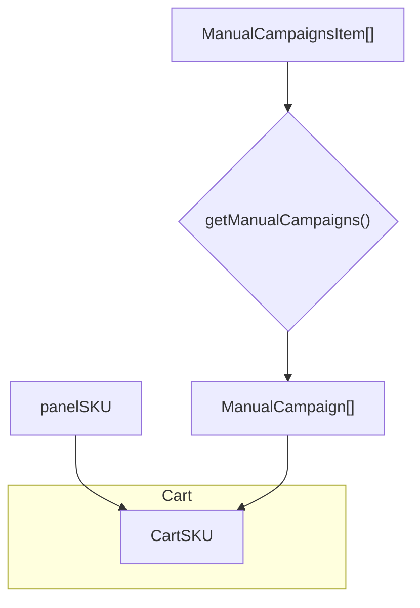
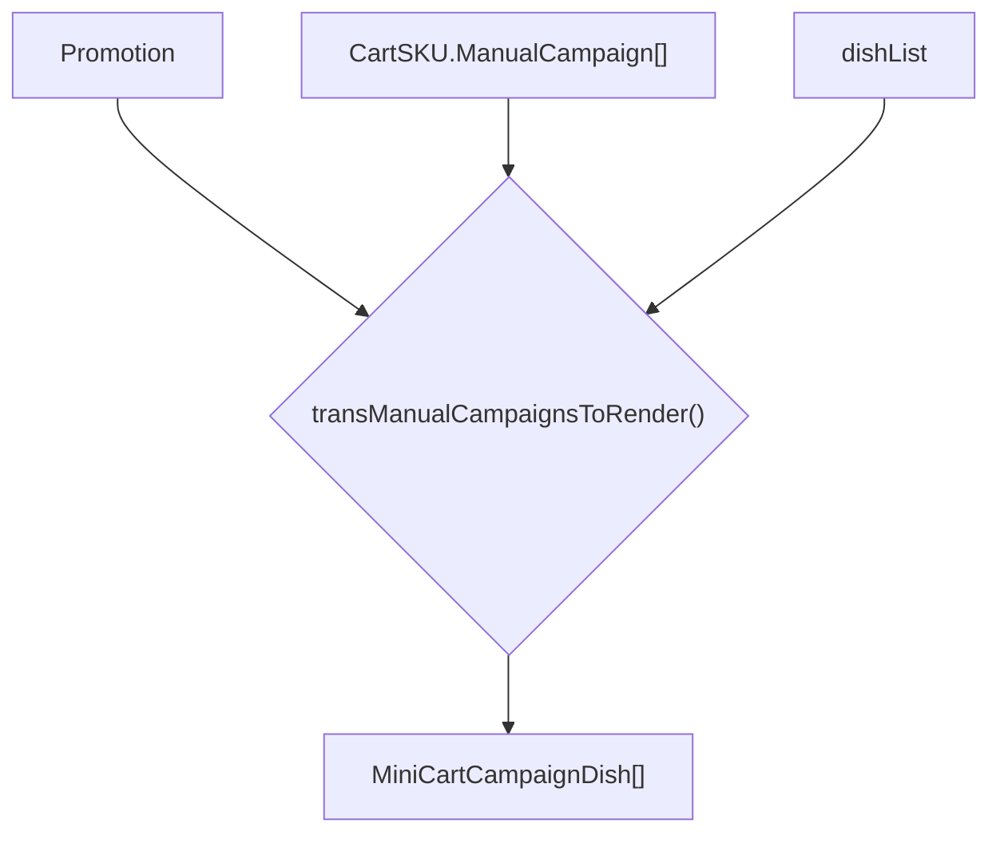

``` mermaid
flowchart TD
    A[Promotion] --> C
    B[SKU] --> C{"getPanelPromoData()"}
    C -->D["panelPromoData {ManualCampaignsItem[] }"]
```

```mermaid
flowchart TD
    A["ManualCampaignsItem[]"] --> F{"getManualCampaigns()"}
    %% B[ManualCampaign] --> F
    E[panelSKU]-->G
    F -->D["ManualCampaign[]"]
        D--> G
    subgraph Cart
        G[CartSKU]
    end
```

``` mermaid
flowchart TD
    A[Promotion] --> F
    B["CartSKU.ManualCampaign[]"] --> F{"transManualCampaignsToRender()"}
    E[dishList]--> F -->D["MiniCartCampaignDish[]"]
```