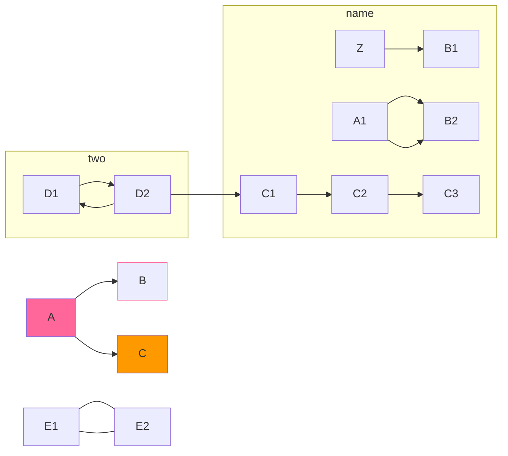
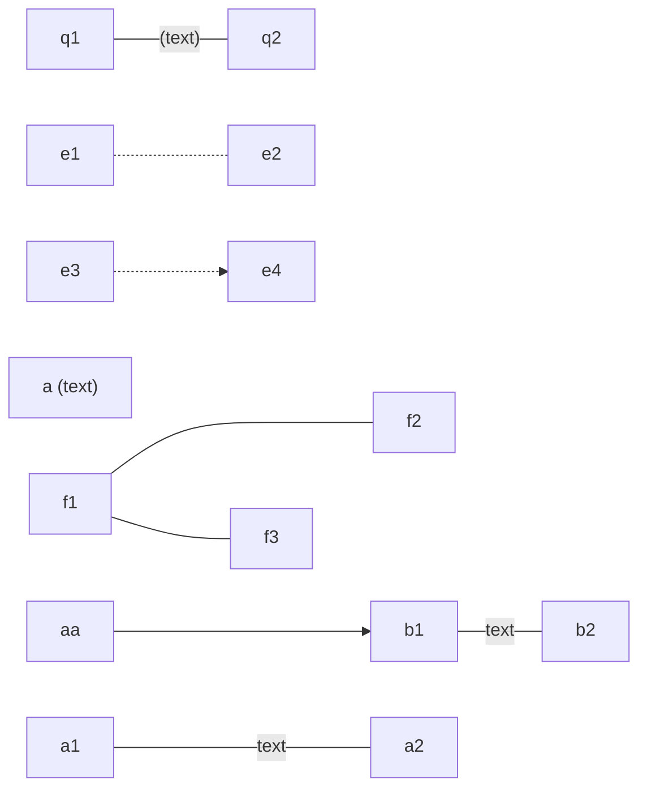

```mermaid
graph TD; %% The statement define the type and direction of the chart.
id; %% A node.
A[asd];
A[123]; %% the last text found for the node tha will be used.
A; %% You can omit text definitions for later use.
B[hello]
```

``` mermaid
graph RL; %% BT, TD/TB, RL 
FOO(A node with round edge)
FOO-->BAR
R5[/trapezoid\]
C{ rhombus shape} 
D[[ subroutine shape]]
E[(cylindrical shape)]
F((circle shape))
G> asymmetric shape ]
R1{{hexagon shape}}
R2[/parallelogram/]
R3[\parallelogram alt\]
```

```mermaid
graph LR$$;

A1-->B1
A2---B2
A3--text in the middle---B3
A4-->|text in the middle|B4
A5--text in the middle-->B5
```
