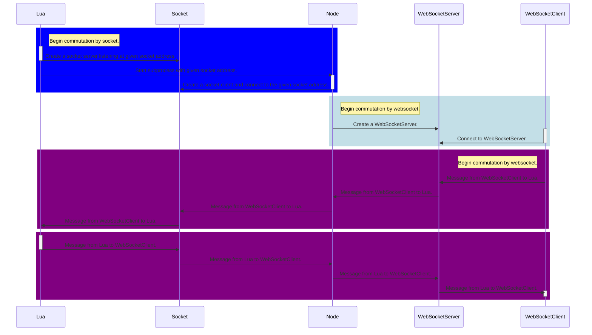

```mermaid
sequenceDiagram
    rect blue
    note right of Lua: Begin commutation by socket.
    activate Lua
    Lua->>Socket: Create a socket server listening at given socket address.
    deactivate Lua
    Lua->>Node: Start subprocess with given socket address.
    activate Node
    Node ->> Socket: Create a socket client and connect to the given socket address.
    deactivate Node
    end

    rect rgba(136, 192, 208, 0.5)
    note right of Node: Begin commutation by websocket.
    Node ->> WebSocketServer: Create a WebSocketServer.
    activate WebSocketClient
    WebSocketClient ->> WebSocketServer: Connect to WebSocketServer.
    deactivate WebSocketClient
    end

    rect purple
    note left of WebSocketClient: Begin commutation by websocket.
    WebSocketClient ->> WebSocketServer: Message from WebSocketClient to Lua.
    WebSocketServer ->> Node: Message from WebSocketClient to Lua.
    Node ->> Socket: Message from WebSocketClient to Lua.
    Socket ->> Lua: Message from WebSocketClient to Lua.
    end
    
    rect purple
    activate Lua
    Lua->>Socket: Message from Lua to WebSocketClient.
    deactivate Lua
    Socket ->> Node: Message from Lua to WebSocketClient.
    Node ->> WebSocketServer: Message from Lua to WebSocketClient.
    WebSocketServer ->> WebSocketClient: Message from Lua to WebSocketClient.
    activate WebSocketClient
    deactivate WebSocketClient
    end
```